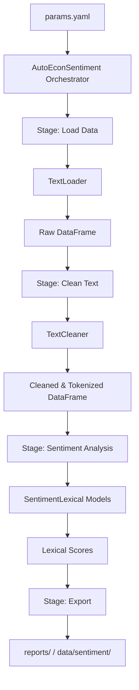
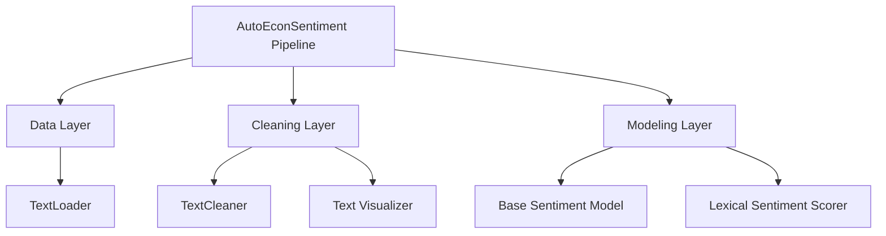

# AutoEconSentiment System Architecture and File Structure

`auto-econ-sentiment` is a robust, modular, and configuration-driven pipeline designed for extracting and analyzing economic sentiment from textual data. It leverages a decoupled architecture where data loading, text cleaning, and lexical scoring are distinct stages orchestrated by a central pipeline.

## 1. High-Level Logic Flow

The library operates through a sequence of well-defined stages, orchestrated by the `AutoEconSentiment` pipeline class. The flow ensures that raw text is progressively structured and scored against various lexical dictionaries.



## 2. Component Tree (Architecture Tree)

The system is organized into specialized layers governed by the pipeline.



## 3. Library Components (`src/auto_econ_sentiment/`)

### 3.1 `pipeline.py` — Main Orchestrator
The `AutoEconSentiment` class is the primary entry point. It orchestrates loading, cleaning, and sentiment analysis via its `run()` method. Accepts `import_file_path`, `text_column`, `date_column`, and `export_path`. Can also be invoked from the command line with `--test` for a built-in synthetic data run. It manages intermediate state and exports the final combined results.

### 3.2 `clean/text_loader.py` — Data Loader
`TextLoader` handles loading input data from `csv`, `parquet`, and `parquet.gzip` formats. It ensures structural requirements are met (e.g., verifying `text_column` and `date_column` are present) and returns a clean copy of the DataFrame.

### 3.3 `clean/text_clean.py` — Text Cleaner
`TextCleaner` applies a configurable multi-step cleaning pipeline:
- HTML stripping and unicode normalization
- British-to-American English conversion (`clean/references/british_2_american.py`)
- Number and percentage normalization
- Configurable header/boilerplate removal
- Word tokenization (splits text into token lists)
- Porter stemming (reduces tokens to root forms for stemmed dictionaries)

Cleaned text is assigned a unique `id_text` to maintain alignment.

### 3.4 `models/sentiment_lexical.py` — Lexical Sentiment Model
Computes bag-of-words sentiment against multiple central bank and financial dictionaries. Employs user-selected aggregation methods:
*   **`posneg`**: Normalizes sentiment by the total count of matched sentiment words. 
    $$ \text{Sentiment}_{\text{posneg}} = 1 + \frac{N_{\text{pos}} - N_{\text{neg}}}{N_{\text{pos}} + N_{\text{neg}}} $$
*   **`allwords`**: Normalizes sentiment by the total number of tokens in the entire document.
    $$ \text{Sentiment}_{\text{allwords}} = 1 + \frac{N_{\text{pos}} - N_{\text{neg}}}{N_{\text{total}}} $$

### 3.5 `models/sentiment_base.py` — Abstract Base
`SentimentBase` is the abstract base class for sentiment models, providing shared input DataFrame handling and the `text_column` interface.

### 3.6 `data/lexical_master_dict.yaml` — Dictionary Definitions
Master YAML file containing the positive/negative word lists for all 6 supported dictionaries: `hubert`, `lm`, `hiv`, `correa`, `bn`, `ap`.

### 3.7 `exceptions.py` — Custom Exceptions
Defines `DataLoadError` and `SentimentAnalysisError` for structured error handling throughout the pipeline.

### 3.8 `utils/load_yaml.py` — YAML Config Loader
`load_yaml_config()` loads and validates pipeline configuration from a YAML file using `yaml.safe_load()`.

### 3.9 `utils/paths.py` — Path Utilities
Shared path resolution helpers.

### 3.10 `clean/text_viz.py` — Cleaning Visualizer
Utilities for visualizing text before and after cleaning (for exploratory and debugging use).

## 4. Tests (`tests/`)

The test suite is in `tests/test_pipeline.py` and covers the full pipeline from data loading to sentiment output. Run with:

```bash
uv run pytest
```

| Test | Description |
|------|-------------|
| `test_loader_synthetic_csv` | Verifies `TextLoader` correctly loads a synthetic CSV. |
| `test_loader_missing_column` | Confirms an error is raised when required columns are absent. |
| `test_loader_unsupported_format` | Confirms an error is raised for unsupported file types. |
| `test_loader_returns_copy` | Verifies the loader returns a defensive copy. |
| `test_cleaner_basic_run_on_fomc` | Runs `TextCleaner` on real FOMC data and validates output shape. |
| `test_cleaner_header_removal` | Verifies boilerplate header strings are removed. |
| `test_cleaner_tokenize_fomc` | Checks tokenized output is a non-empty list of strings. |
| `test_cleaner_stem_fomc` | Confirms stemming reduces tokens to root forms. |
| `test_cleaner_percentage_normalization` | Verifies percentages are normalized correctly. |
| `test_cleaner_assigns_id_text` | Confirms each row receives a unique `id_text` identifier. |
| `test_cleaner_missing_column` | Confirms a clear error when the text column is missing. |
| `test_sentiment_hubert_posneg` | Runs Hubert dictionary with `posneg` method and checks score range. |
| `test_sentiment_lm_posneg` | Runs LM dictionary with `posneg` method. |
| `test_sentiment_correa_allwords` | Runs Correa dictionary with `allwords` method. |
| `test_sentiment_text_column_override` | Verifies overriding the text column does not mutate the original DataFrame. |
| `test_sentiment_unknown_dictionary` | Confirms a clear error for unknown dictionary names. |
| `test_sentiment_word_counts_nonzero` | Verifies that matched sentiment word counts are > 0 on real data. |
| `test_public_api_imports` | Confirms the public API imports correctly from the package. |
| `test_version_is_string` | Verifies `__version__` is a valid string. |

## 5. Project Directory Tree

The repository maintains strict boundaries between source code, reference configurations, original datasets, and generated outputs.

```text
.
├── data/                          # Immutable and derived data (gitignored)
│   ├── raw/                       # Original, untouched source files
│   │   ├── basic_tests/           # Datasets for sanity checks and unit tests
│   │   └── speeches/              # Large downloaded datasets (e.g., CBS Speeches)
│   └── sentiment/                 # Generated sentiment output tables and cleaned text
├── docs/                          # Architectural and user documentation
├── notebooks/                     # Exploratory analysis and pipeline demonstrations
├── references/                    # CONFIGURATION CENTER
│   └── configs/                   # YAML configuration files (e.g., params_cb_speeches.yaml)
├── reports/                       # Automated model outputs and pipeline logs
├── src/                           # SOURCE CODE
│   ├── auto_econ_sentiment/       # Core Python library package
│   │   ├── clean/                 # Data loading and text processing logic
│   │   ├── data/                  # Built-in master dictionaries and configuration
│   │   ├── models/                # Lexical and baseline models
│   │   ├── utils/                 # Path handling and YAML parsing helpers
│   │   └── pipeline.py            # Main pipeline orchestrator
│   └── data/                      # Data fetching and ingestion scripts
└── tests/                         # Unit and integration test suite
```

## 6. Configuration-Driven Design

The pipeline relies heavily on the `params.yaml` construct to guarantee reproducibility. This allows you to:
1.  Swap out target text or date columns rapidly.
2.  Enable/disable specific cleaning procedures (e.g., `stem`, `tokenize`, `clean_numbers_percentages`).
3.  Designate specific lexical dictionaries (`unstemmed` vs. `stemmed`) and aggregation methods (`posneg`, `allwords`).
4.  Run entirely different datasets without modifying the core `pipeline.py` Python logic.
