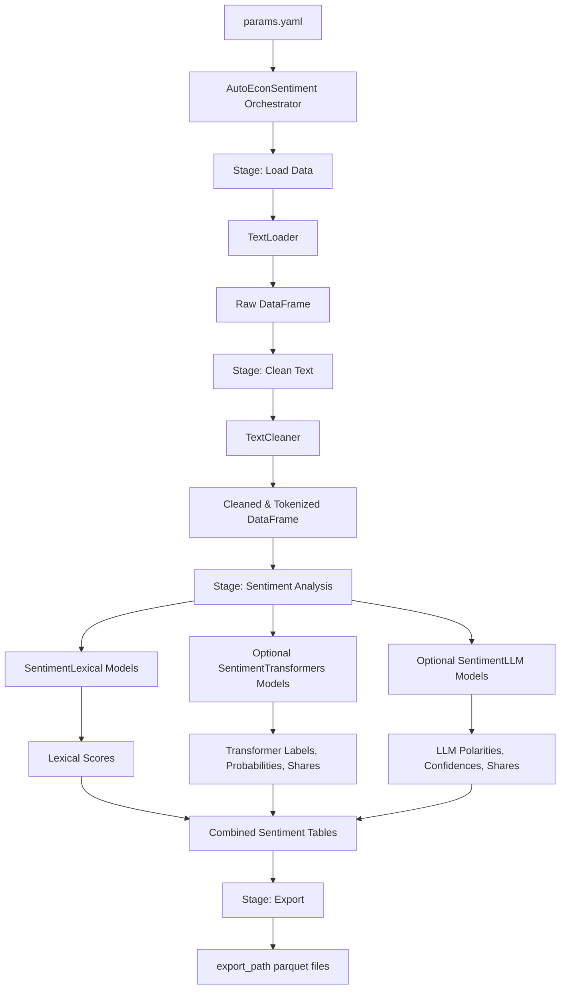
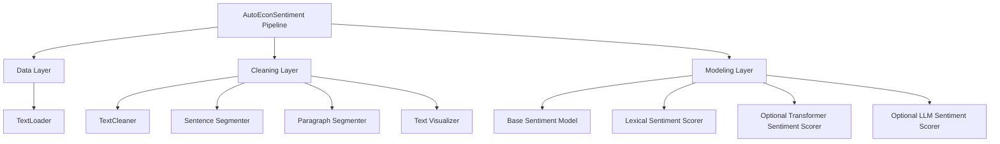

# AutoEconSentiment System Architecture and File Structure

`auto-econ-sentiment` is a modular, configuration-driven pipeline for extracting and analyzing economic sentiment from text data. It keeps lexical scoring as the stable baseline while allowing optional transformer and LLM sentiment models to run through the same load, clean, score, and export workflow.

## 1. High-Level Logic Flow

The library operates through a sequence of well-defined stages, orchestrated by the `AutoEconSentiment` pipeline class. Raw text is loaded and cleaned once, then can be scored by lexical dictionaries, optional transformer classifiers, optional LLMs, or any combination.


```mermaid
graph TD
    A[params.yaml] --> B[AutoEconSentiment Orchestrator]
    B --> C[Stage: Load Data]
    C --> D[TextLoader]
    D --> E[Raw DataFrame]
    E --> F[Stage: Clean Text]
    F --> G[TextCleaner]
    G --> H[Cleaned & Tokenized DataFrame]
    H --> I[Stage: Sentiment Analysis]
    I --> J[SentimentLexical Models]
    I --> N[Optional SentimentTransformers Models]
    I --> Q[Optional SentimentLLM Models]
    J --> K[Lexical Scores]
    N --> O[Transformer Labels, Probabilities, Shares]
    Q --> R[LLM Polarities, Confidences, Shares]
    K --> P[Combined Sentiment Tables]
    O --> P
    R --> P
    P --> L[Stage: Export]
    L --> M[export_path parquet files]
```

## 2. Component Tree (Architecture Tree)

The system is organized into specialized layers governed by the pipeline.


```mermaid
graph TD
    Pipeline[AutoEconSentiment Pipeline] --> DataLayer[Data Layer]
    Pipeline --> CleanLayer[Cleaning Layer]
    Pipeline --> ModelLayer[Modeling Layer]

    DataLayer --> TextLoader
    
    CleanLayer --> TextCleaner
    CleanLayer --> TextSegmenter[Sentence Segmenter]
    CleanLayer --> ParagraphSegmenter[Paragraph Segmenter]
    CleanLayer --> TextViz[Text Visualizer]

    ModelLayer --> SentimentBase[Base Sentiment Model]
    ModelLayer --> SentimentLexical[Lexical Sentiment Scorer]
    ModelLayer --> SentimentTransformers[Optional Transformer Sentiment Scorer]
    ModelLayer --> SentimentLLM[Optional LLM Sentiment Scorer]
```

## 3. Library Components (`src/auto_econ_sentiment/`)

### 3.1 `pipeline.py` (Main Orchestrator)
The `AutoEconSentiment` class is the primary entry point. It orchestrates loading, cleaning, lexical scoring, optional transformer and LLM scoring, and exports via its `run()` method. Each stage is also callable on its own: `load_data()`, `clean_data()`, `analyze_sentiment_lexical()`, `analyze_sentiment_transformer()` and `analyze_sentiment_llm()`. It accepts `import_file_path`, `text_column`, `date_column`, and `export_path`. It can also be invoked from the command line with `--test` for a built-in synthetic data run.

Pipeline state is kept explicit:

- `df_raw`
- `df_clean`
- `df_sent_lexical`
- `df_sent_transformer`
- `df_transformer_sentence_probabilities`
- `df_sent_llm`
- `df_llm_sentence_probabilities`

`resolve_lexical_config()`, `resolve_transformer_config()` and `resolve_llm_config()` read the top-level `lexical`, `transformer` and `llm` blocks of `params.yaml`, falling back to the legacy nested `models.*` layouts. The transformer config parser accepts both the current package format and the older `Econ_Text_Algos` model-list format using `name`, `short_name`, `label_mapping`, and `sentiment_values`.

### 3.2 `clean/text_loader.py` (Data Loader)
`TextLoader` loads a single tabular file (`.csv`, `.xlsx`/`.xls`, `.parquet`, `.parquet.gzip`) or a directory of `.txt` and Markdown files, one document per file. For tabular input it verifies that `text_column` and `date_column` are present and parses the dates. For directory input it parses dates from filenames, can label subdirectories through `group_column`, and derives `id_text` from the filename. Either way it returns a copy standardized to `text` and `date` columns. See [data.md](data.md) for the directory options.

### 3.3 `clean/text_clean.py` (Text Cleaner)
`TextCleaner` applies a configurable multi-step cleaning pipeline:
- HTML stripping, encoding repair and unicode normalization
- Quote, punctuation and whitespace normalization (whitespace normalization collapses newlines, so paragraph breaks do not survive into `text_clean`)
- Number and percentage normalization
- Configurable header and footer removal (`remove_headers`, `header_patterns`, `footer_patterns`), matched against the start or end of the normalized text
- Word tokenization into `text_tokens` and `text_tokens_str`
- Porter stemming into `text_stems`, for the stemmed dictionaries

Each document is assigned a unique `id_text` to maintain alignment, and the cleaned table is written to `cleaned.parquet.gzip` in the export path. A British-to-American spelling map ships in `clean/references/british_2_american.py` but is not applied by the cleaner.

### 3.4 `clean/text_segmentation.py` (Text Segmenter)
`TextSegmenter` splits documents into sentence-level rows for sentence-level transformer and LLM scoring, numbered by `sentence_number` within each `id_text`. It uses NLTK `sent_tokenize` with a regex fallback that protects abbreviations and single initials; `tokenizer_name` reports which one ran, and `require_nltk=True` fails instead of falling back. `min_chars` drops fragments below a specified length, and `drop_invalid=True` also drops non-sentential fragments such as voting rosters and headers.

`ParagraphSegmenter` splits documents on blank lines into rows numbered by `paragraph_number`, and `TextSegmenter` can run on its output so sentences keep their paragraph number. Because the cleaner removes newlines, paragraph segmentation runs on the original `text` column rather than `text_clean`. The pipeline itself segments by sentence only; paragraph-level scoring is on the [roadmap](roadmap.md).

### 3.5 `models/sentiment_lexical.py` (Lexical Sentiment Model)
Computes bag-of-words sentiment against multiple central bank and financial dictionaries. Employs user-selected aggregation methods:
*   **`posneg`**: Normalizes sentiment by the total count of matched sentiment words. A document with no matches gets the neutral value.
    $$ \text{Sentiment}_{\text{posneg}} = 1 + \frac{N_{\text{pos}} - N_{\text{neg}}}{N_{\text{pos}} + N_{\text{neg}}} $$
*   **`allwords`**: Normalizes sentiment by the total number of tokens in the document, counted after English stop words are removed.
    $$ \text{Sentiment}_{\text{allwords}} = 1 + \frac{N_{\text{pos}} - N_{\text{neg}}}{N_{\text{total}}} $$

Both scores keep the Apel-Blix Grimaldi $+1$ convention on $[0, 2]$. Each is paired with a `_net` column that subtracts the one, putting it on $[-1, 1]$ with zero as neutral, the scale transformer scores use. See the score-scale table in [data.md](data.md).

### 3.6 `models/sentiment_transformers.py` (Optional Transformer Sentiment Model)
`SentimentTransformers` wraps Hugging Face sequence-classification models behind optional dependencies. `torch` and `transformers` are imported lazily so the base package can still run lexical sentiment without installing or downloading transformer models.

Transformer features:

- explicit `label_map` validation,
- batched model inference,
- document-level scoring with `aggregation: byalltext`,
- sentence-level scoring with `aggregation: bysentence`, counting sentences whose class probability clears `sentence_probability_cutoff` (`sentence_probability_aggregation: cutoff`, the default) or averaging sentence probabilities (`mean`),
- sentence probability exports carrying each sentence's number and text,
- sentence aggregation by `id_text`,
- harmonized positive/neutral/negative counts, shares, and net sentiment when `output_schema: shares` is enabled,
- in cutoff mode, `{model}_sentiment_posneg_net` and `{model}_sentiment_allsentences_net`, the sentence-level counterparts of the lexical `posneg` and `allwords` scores.

The transformer path treats labels as model-specific. Generic model labels such as `LABEL_0` are mapped through configuration rather than hard-coded in the model class.

### 3.7 `models/sentiment_llm.py` (Optional LLM Sentiment Model)
`SentimentLLM` scores text with a large language model through a local Ollama server or any OpenAI-compatible chat completions API, using plain HTTP rather than a provider SDK. The model returns a polarity in $\{-1, 0, 1\}$ and a confidence in $[0, 1]$; document scores are their product, and sentence-level scoring produces the same harmonized counts, shares and net sentiment as the transformer path. Provider, model, prompt version and temperature are recorded in the output. See [llm_scoring.md](llm_scoring.md).

### 3.8 `models/sentiment_base.py` (Base Class)
`SentimentBase` is the shared base class for sentiment models, providing input DataFrame handling, the `text_column` interface and CSV export.

### 3.9 `data/lexical_master_dict.yaml` (Dictionary Definitions)
Master YAML file in `src/auto_econ_sentiment/data/` containing the positive/negative word lists for all 6 supported dictionaries: `hubert`, `lm`, `hiv`, `correa`, `bn`, `ap`. `bn` and `ap` are stemmed dictionaries and are matched against `text_stems`; the others are matched against `text_tokens_str`.

### 3.10 `exceptions.py` (Custom Exceptions)
Defines structured error classes throughout the pipeline:
- `AutoEconSentimentError`: Base exception for the package.
- `ConfigurationError`: Raised for invalid or conflicting pipeline configurations.
- `DataLoadError`: Raised when input data cannot be loaded or validated.
- `SentimentAnalysisError`: Raised during failures in model execution or scoring.

### 3.11 `utils/load_yaml.py` (YAML Config Loader)
`load_yaml_config()` loads and validates pipeline configuration from a YAML file using `yaml.safe_load()`.

### 3.12 `utils/paths.py` (Path Utilities)
Shared path resolution helpers.

### 3.13 `clean/text_viz.py` (Cleaning Visualizer)
Utilities for visualizing text before and after cleaning (for exploratory and debugging use).

## 4. Tests (`tests/`)

The test suite covers the full pipeline across nine dedicated modules in `tests/`:

- `tests/test_pipeline.py`: Full-pipeline integration, `TextLoader` validation, `TextCleaner` normalization, lexical scoring, and package public API imports.
- `tests/test_text_loader.py`: Directory-of-text loading for `.txt` and Markdown files, filename date parsing, group columns and recursion.
- `tests/test_paragraph_segmentation.py`: Paragraph splitting and paragraph numbers inherited by sentence rows.
- `tests/test_sentiment_llm.py`: LLM prompt formatting, response parsing, scoring scales and pipeline integration, with live-provider tests skipped by default.
- `tests/test_sentiment_transformers.py`: Lazy imports without optional dependencies, explicit `label_map` validation, and prediction post-processing.
- `tests/test_text_segmentation.py`: Sentence splitting via NLTK/regex, minimum character threshold handling, and index alignment across sentence rows.
- `tests/test_transformer_config.py`: Configuration resolution across modern flat keys and legacy nested YAML schemas.
- `tests/test_transformer_sentence_aggregation.py`: Sentence aggregation arithmetic, confident label counting, and per-model cutoff overrides.
- `tests/test_transformers.py`: Isolated model test doubles, harmonized count/share outputs, and formula verification.

Run the test suite with:

```bash
uv run --extra dev pytest
```

## 5. Project Directory Tree

The repository maintains strict boundaries between source code, reference configurations, original datasets, and generated outputs.

```text
.
├── data/                          # Immutable and derived data (gitignored)
│   ├── raw/                       # Original, untouched source files
│   │   ├── basic_tests/           # Datasets for sanity checks and unit tests
│   │   ├── speeches/              # Large downloaded datasets (e.g., CBS Speeches)
│   │   └── statements/            # Per-document .txt files, one directory per central bank
│   └── sentiment/                 # Generated sentiment output tables and cleaned text
├── docs/                          # Architectural and user documentation
├── notebooks/                     # Exploratory analysis and pipeline demonstrations
├── params.yaml                    # Default pipeline configuration
├── references/                    # Reference lookups (e.g., ISO3 to ISO2 country codes)
├── reports/                       # Generated reports and figures (gitignored)
├── src/                           # SOURCE CODE
│   ├── auto_econ_sentiment/       # Core Python library package
│   │   ├── clean/                 # Data loading, text cleaning, and segmentation logic
│   │   ├── data/                  # Built-in master dictionaries and configuration
│   │   ├── models/                # Lexical and optional transformer and LLM models
│   │   ├── utils/                 # Path handling and YAML parsing helpers
│   │   └── pipeline.py            # Main pipeline orchestrator
│   └── data/                      # Data fetching and ingestion scripts
└── tests/                         # Unit and integration test suite
```

## 6. Configuration-Driven Design

The pipeline relies heavily on the `params.yaml` construct to guarantee reproducibility. This allows you to:
1.  Swap out target text or date columns rapidly.
2.  Enable/disable specific cleaning procedures (e.g., `stem`, `tokenize`, `clean_numbers_percentages`).
3.  Designate specific lexical dictionaries (`unstemmed` vs. `stemmed`) and aggregation methods (`posneg`, `allwords`).
4.  Enable optional transformer models with `transformer.enabled` (top-level key; `models.transformer.enabled` supported via backward-compatible fallback).
5.  List multiple transformer models using either the package-native `model_name` / `model_name_short` / `label_map` format or the original `name` / `short_name` / `label_mapping` / `sentiment_values` format.
6.  Choose transformer aggregation modes (`byalltext`, `bysentence`, or aliases such as `full_text` and `sentence_pos`), and for `bysentence` the `sentence_probability_aggregation` mode (`cutoff` or `mean`), `sentence_probability_cutoff` and `min_sentence_chars`, each overridable per model.
7.  Enable optional LLM scoring with `llm.enabled`, choosing the provider, output scale, temperature and confidence cutoff.
8.  Run entirely different datasets without modifying the core `pipeline.py` Python logic.
